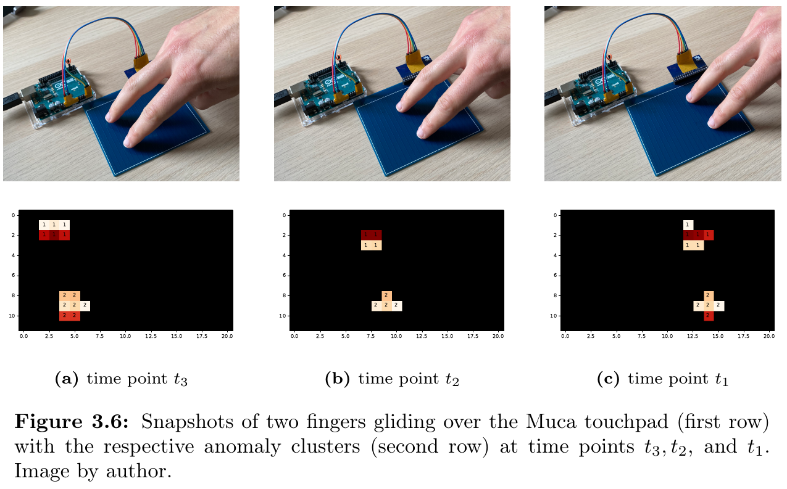
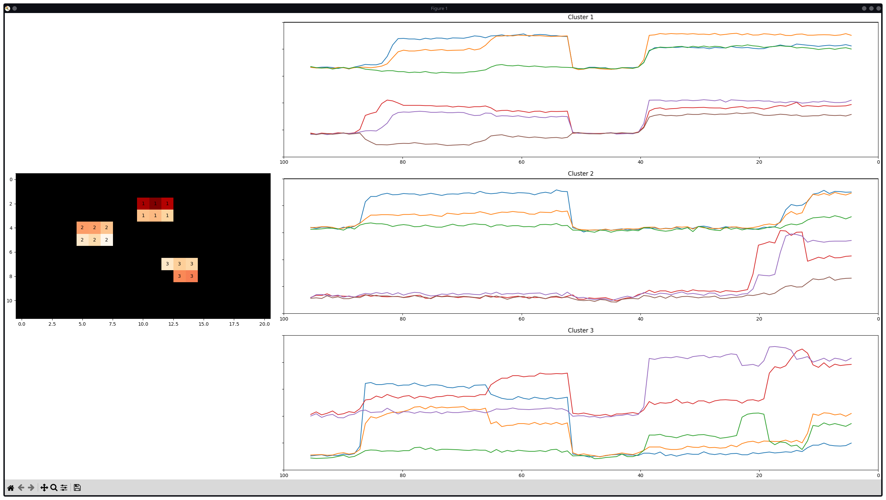

# CapSense - A Python application to monitor capacitive touch sensors



This repository contains the Python application that I developed for my master thesis at the [Carinthia University of Applied Sciences](https://www.fh-kaernten.at).
The application is purely written in Python and interfaces with a custom soft sensor from the [ADMiRE research center](https://forschung.fh-kaernten.at/admire/), but also works with the [Muca touchpad](https://muca.cc/shop/touchpad).
It reads the capacitive sensor values and segregates anomalic regions (aka contact points) into clusters.
A time-series visualization of the first three clusters provides a tool to further analyze the behavior of the contact points.



## Requirements

- The [Muca touchpad](https://muca.cc/shop/touchpad) with the [Muca breakout board](https://muca.cc/shop/muca)
- An Arduino Uno (or a similar microcontroller board)
    - Flashed with the [Muca code](https://github.com/muca-board/Muca/blob/master/examples/Muca_Raw_Basic/Muca_Raw_Basic.ino) that uses the `SendRawString` method in the main loop
- A USB cable
- A computer running the Python application

## Setup

Clone this repository and set up the development environment by executing the `bootstrap.sh` script, it

- sets up a Python virtual environment,
- and installs dependencies.

Activate the virtual environment via

```bash
. ./.venv/bin/activate
```

Connect the hardware via a USB cable and find out the port name to which it is connected.

### Configuration

The [AppConfig](./src/config.py) provides properties to configure the application.
Entry point of the application is the [main.py](./src/main.py) file whith the following default configuration.
Adjust the settings according to your hardware setup:

```python
config = AppConfig(
    serial_port="/dev/ttyACM0",
    baudrate=115200,
    connection_timeout=0.1,
    buffer_size=30,
    top_k_buffer_size=100,
    nrows=12,
    ncols=21,
    sensitivity=3.0,
    log_data=True,
    data_directory="~/tmp/soft-sensor-monitoring-logs/"
)
```

### Running the application

Run the application with

```bash
python3 src/soft-sensor-monitor/main.py
```

### Executing tests

Run the tests with

```bash
poetry run pytest
```
